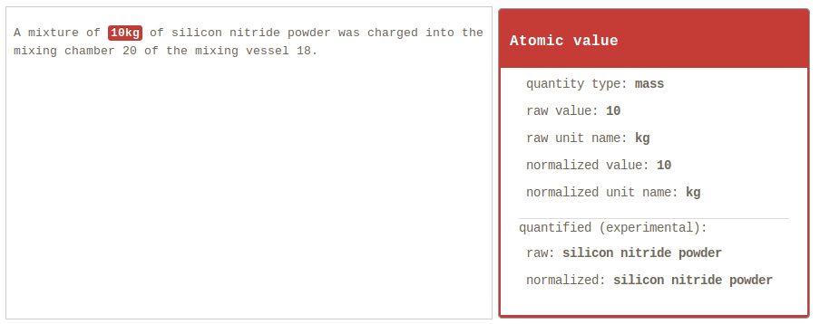

# grobid-quantities

<!--  -->
<!--  -->

__Work in progress.__

The goal of this GROBID module is to recognize in textual documents any expressions of measurements (e.g. _pressure_, _temperature_, etc.), to parse and normalization them, and finally to convert these measurements into SI units. We focus our work on technical and scientific articles (text, XML and PDF input) and patents (text and XML input). 

One additional goal is also to identify and attached to the measurements the "quantified" substance, e.g. _silicon nitride powder_ in 

As the other GROBID models, the module relies only on machine learning and uses linear CRF. 

## Documentation

You can find the latest documentation [here](http://grobid-quantities.readthedocs.io). 

## License

GROBID and grobid-quantities are distributed under [Apache 2.0 license](http://www.apache.org/licenses/LICENSE-2.0). 

Contact: Patrice Lopez (<patrice.lopez@science-miner.com>), Luca Foppiano (<luca.foppiano@inria.fr>)