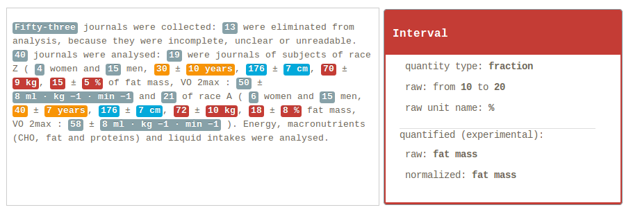

# grobid-quantities

[](http://www.apache.org/licenses/LICENSE-2.0.html)
<!-- [](https://travis-ci.org/kermitt2/grobid-quantities) -->
<!-- [](https://coveralls.io/r/kermitt2/grobid-quantities) -->
<!-- [](https://readthedocs.org/projects/grobid-quantities/?badge=latest) -->

__Work in progress.__

The goal of this GROBID module is to recognize in textual documents any expressions of measurements (e.g. _pressure_, _temperature_, etc.), to parse and normalization them, and finally to convert these measurements into SI units. We focus our work on technical and scientific articles (text, XML and PDF input) and patents (text and XML input). 



One additional goal is also to identify and attached to the measurements the "quantified" substance, e.g. _silicon nitride powder_ in 


As the other GROBID models, the module relies only on machine learning and uses linear CRF. 

## Install, build, run

Building grobid-quantities requires maven and JDK 1.8.  

First install the latest development version of GROBID as explained by the [documentation](http://grobid.readthedocs.org).

Copy the module quantities as sibling sub-project to grobid-core, grobid-trainer, etc.:
> cp -r grobid-quantities grobid/

Try compiling everything with:
> cd PATH-TO-GROBID/grobid/

> mvn -Dmaven.test.skip=true clean install

Run some test: 
> cd PATH-TO-GROBID/grobid/grobid-quantities

> mvn compile test

**The models have to be trained before running the tests!**

## Training

For training the quantity model:
> cd PATH-TO-GROBID/grobid/grobid-quantities

> mvn generate-resources -Ptrain_quantities

For training the unit model:

> mvn generate-resources -Ptrain_units

For the moment, the default training stop criteria are used. So, the training can be stopped manually after 1000 iterations, simply do a "control-C" to stop the training and save the model produced in the latest iteration. 1000 iterations are largely enough. Otherwise, the training will continue beyond several thousand iterations before stopping. 
The models will be saved under ```grobid-home/models/quantities``` and ```grobid-home/models/units``` respectively.

## Training data

As the rest of GROBID, the training data is encoded following the [TEI P5](http://www.tei-c.org/Guidelines/P5). See the GROBID quantities [annotation guidelines page](doc/Annotation-Guidelines.md) for detailed explanations and examples.  

## Generation of training data

Training data generation works the same as in GROBID, with executable name ```createTrainingQuantities```, for example:

> java -jar target/grobid-quantities-0.4.0-SNAPSHOT.one-jar.jar -gH ../grobid-home/ -gP ../grobid-home/config/grobid.properties -dIn ~/grobid/grobid-quantities/src/test/resources/ -dOut ~/test/ -exe createTrainingQuantities

The input directory can contain PDF (.pdf, scientific articles only), XML/TEI (.xml or .tei, for patents and scientific articles) and text files (.txt).

For the unit model the training data cannot be generated automatically from PDF. The overall effort is similar to create the training data from scratch manually.
**Advanced**: There is the possibility to generate a simple unit training data file (covering mostly all the unit once, and the combiation between SI base units and prefixes). This generator uses the file lexicon file information (notation, inflections and so on, e.g. resources/en/units.json).

To generate the data:

 ```bash
 > java -jar target/grobid-quantities-0.4.0-SNAPSHOT.one-jar.jar -gH ../grobid-home/ -gP ../grobid-home/config/grobid.properties
 -dIn input/resources -dOut /tmp/ -exe generateTrainingUnits
 ```

The input directory should be the directory containing prefixes.txt and units.json (normally by language) (e.g. of input/resources /~/grobid-quantities/src/main/resources/en)


## Start the service

> mvn -Dmaven.test.skip=true jetty:run-war

Demo/console web app is then accessible at ```http://localhost:8080```

Using ```curl``` POST/GET requests:


```
curl -X POST -d "text=I've lost one minute." localhost:8080/processQuantityText
```

```
curl -GET --data-urlencode "text=I've lost one minute." localhost:8080/processQuantityText
```

Note that the model is designed and trained to work at __paragraph level__. It means that, for the moment, the expected input to the parser is a paragraph or a text segment of similar size, not a complete document. In case you have a long textual document, it is better either to exploit existing structures (e.g. XML/HTML elements) to segment it initially into paragraphs or sentences, or to apply an automatic paragraph/sentence segmentation, and then send separately to grobid-quantities the equivalent of a paragraph-size texts to be processed. 

## License

GROBID and grobid-quantities are distributed under [Apache 2.0 license](http://www.apache.org/licenses/LICENSE-2.0). 

Contact: Patrice Lopez (<patrice.lopez@science-miner.com>), Luca Foppiano (<luca.foppiano@inria.fr>)